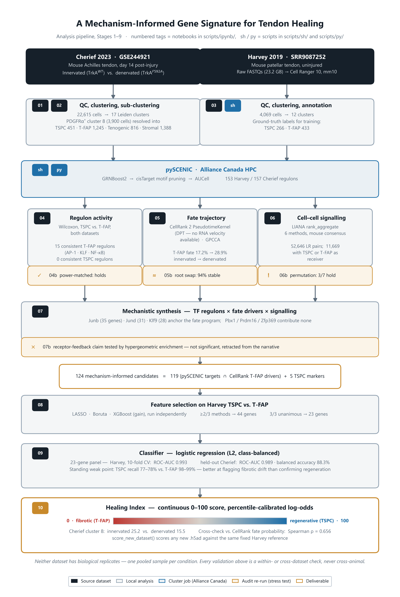

# A Mechanism-Informed Gene Signature for Regenerative vs. Fibrotic Tendon Healing

*MBINF BINF6999 project by Fangyi Li, advised by Dr. Wilder Scott (Sunnybrook Research Institute) and Dr. Yan Yan (University of Guelph).*

Single-cell RNA-seq analysis of mouse Achilles tendon healing, comparing innervated
(regenerative) and denervated (fibrotic) injury at day 14. Regulon (pySCENIC), fate
(CellRank), and signalling (LIANA) analyses are synthesized into a candidate gene set,
distilled by ML feature selection into 44- and 23-gene panels, and trained into a
classifier plus a continuous 0-100 Healing Index. Datasets: Cherief 2023 (GSE244921)
and Harvey 2019.

## Repository map

| Folder | Contents |
|---|---|
| [`scripts/`](scripts/README.md) | All analysis code: notebooks (stages 1-9), HPC pipeline, poster build. Start here |
| [`environments/`](environments/README.md) | Python environments and how to install them |
| [`docs/progress.md`](docs/progress.md) | Stage-by-stage findings and caveats |
| [`data/`](data/) | Inputs and intermediate outputs |
| [`figures/`](figures/) | Generated figures |
| [`BINF6999/`](BINF6999/) | Course deliverables (report, reflection, poster) |
