# Project Progress

**Project:** A Mechanism-Informed Gene Signature for Regenerative vs. Fibrotic Tendon Healing  
**Last updated:** 2026-07-20

---

## Status at a Glance

| Stage | Task | Status |
|---|---|---|
| 0 | Define project scope & research questions | Done ✓ |
| 0 | Literature review (Harvey, Cherief, Howell, Kaji, Moser) | Done ✓ |
| 1a | Download & QC Cherief 2023 scRNA-seq (GSE244921) | Done ✓ |
| 1b | Clustering & cell-type annotation (Cherief 2023) | Done ✓ |
| 1c | Sub-cluster cluster 8 → TSPC / T-FAP separation | Done ✓ |
| 2 | Obtain Harvey 2019 count matrix (Cell Ranger on FASTQs) | Done ✓ |
| 3a | pySCENIC — TF network inference on TSPC / T-FAP | Done ✓ |
| 3b | Label transfer Harvey 2019 → Cherief 2023 cluster 8 | On hold |
| 4 | CellRank — fate trajectory from PDGFRα+ progenitor | Done ✓ (pseudotime caveat) |
| 5 | LIANA — cell-cell communication (innervated vs. denervated) | Done ✓ |
| 6 | Mechanistic summary (TF regulons + upstream signals) | Done ✓ |
| 7 | Feature selection (LASSO + Boruta + XGBoost) | Done ✓ |
| 8 | Classifier training & validation | Done ✓ |
| 9 | Continuous healing index score | Done ✓ |

---

## Stage 0 — Project Setup & Literature ✓

**Goal:** Define the two-arm project structure and establish biological context from key papers.

Two linked arms:
- **Mechanistic arm** — identify TF networks and upstream signals governing the TSPC vs. T-FAP fate decision
- **Applied arm** — compress mechanism-derived gene programs into a minimal classifier (~10–30 genes) for regenerative vs. fibrotic tendon healing

Key papers reviewed: Harvey 2019 (*Nat Cell Biol*) — defines TSPC/T-FAP; Cherief 2023 (*Sci Transl Med*) — innervation/denervation control of healing; Howell 2017, Kaji 2020, Moser 2021 — supporting context on TGFβ, ECM remodelling, and progenitor biology.

---

## Stage 1 — Cherief 2023 scRNA-seq Processing ✓

**Dataset:** GSE244921 — mouse Achilles tendon, day 14 post-injury, innervated (TrkAWT) vs. denervated (TrkAF592A).  
**Scripts:** `scripts/ipynb/01_cherief2023_qc_clustering.ipynb`, `02_cherief2023_subcluster_tspc_tfap.ipynb`

### 1a/1b — QC, clustering & annotation (22,615 cells)

QC filters removed low-quality cells; 22,615 cells retained. Leiden clustering (resolution 0.5) produced 17 clusters annotated by marker expression. The PDGFRα+ stromal population (cluster 8, 3,900 cells) is the focal population — it contains TSPCs and T-FAPs mixed together.

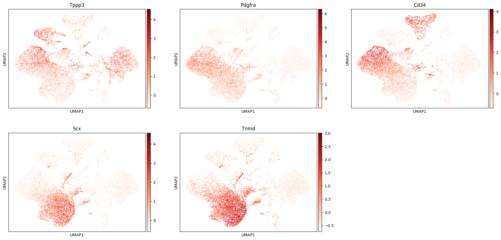

### 1c — Sub-clustering cluster 8: TSPC / T-FAP separation

Re-embedding the 3,900 cluster-8 cells on their own neighbour graph (re-using the full-object PCA) and clustering with Leiden at resolution 0.2 — chosen from a 0.2–1.0 sweep giving 4 / 6 / 10 / 12 / 17 sub-clusters — resolved four sub-populations:

| Sub-cluster | Label | n cells | Key markers |
|---|---|---|---|
| 0 | Stromal | 1,388 | Plagl1, Mest, H19 (imprinted gene signature) |
| 1 | T-FAP | 1,245 | Pi16=1.63, Sfrp2=1.35, Pdgfra=1.48; complement (C3, C4b) |
| 2 | Tenogenic-progenitor | 816 | Thbs4, Kera, Col11a1 |
| 3 | TSPC | 451 | Tppp3=1.76, Prg4 co-elevated; Sfrp2 near-absent |

TSPC are **2.4× enriched in innervated**; T-FAP are **1.46× enriched in denervated** — consistent with the paper's claim that innervation supports regenerative progenitor expansion.

**Correction (2026-08-05):** the method line above previously read "Higher-resolution Leiden (resolution sweep 0.8–1.5)". Both halves were wrong, per `scripts/ipynb/02_cherief2023_subcluster_tspc_tfap.ipynb`. The sweep was **0.2–1.0** and the resolution selected was **0.2** — *lower* than the 0.5 used to cluster the full object, not higher. What separates TSPC from T-FAP is re-computing the neighbour graph on the cluster-8 cells alone, which removes interference from other cell types; raising the resolution does the opposite, fragmenting the compartment into 10 (res 0.6), 12 (res 0.8) and 17 (res 1.0) groups. The old wording therefore described a procedure that could not have produced the four sub-populations tabulated here. Sub-population counts and every downstream result are unaffected — only the description was wrong.

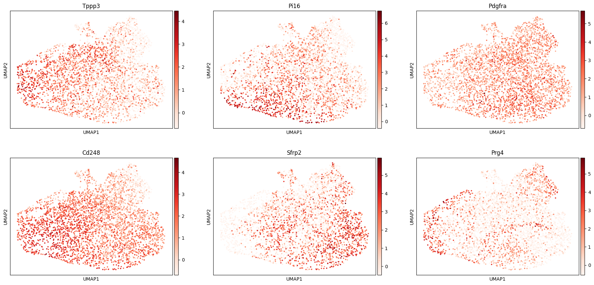

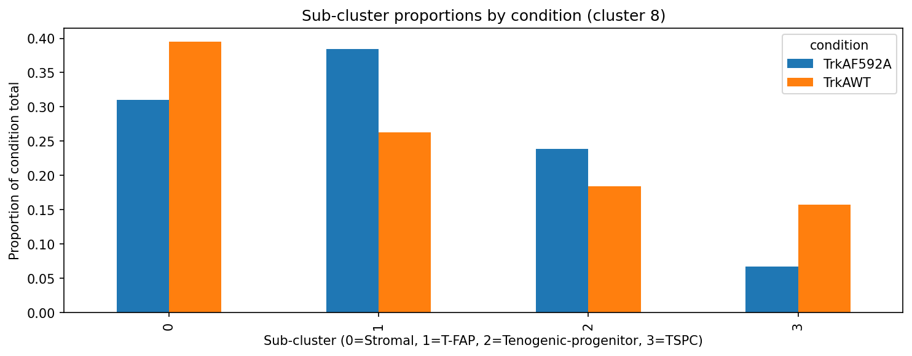

---

## Stage 2 — Harvey 2019 Count Matrix ✓

**Dataset:** PRJNA506218 / SRR9087252 — mouse patellar tendon, uninjured adult.  
**Script:** `scripts/ipynb/03_harvey2019_qc_clustering.ipynb`; Cell Ranger job: `scripts/sh/cellranger_harvey.sh`

Raw FASTQs (23.2 GB) downloaded from SRA on HPC, aligned with Cell Ranger 10 against mm10. After QC filtering (min 700 genes, <15% MT, <5,000 genes), **4,069 cells** retained across 12 clusters. TSPC (Tppp3+, clusters 2 & 8) and T-FAP (Ly6a+/Pi16+, clusters 3 & 11) annotated by marker expression and validated with Wilcoxon DEG analysis.

Harvey 2019 provides ground-truth TSPC/T-FAP labels for both pySCENIC input and future classifier training — it is the only dataset where both populations are explicitly characterised in an uninjured, homeostatic context.

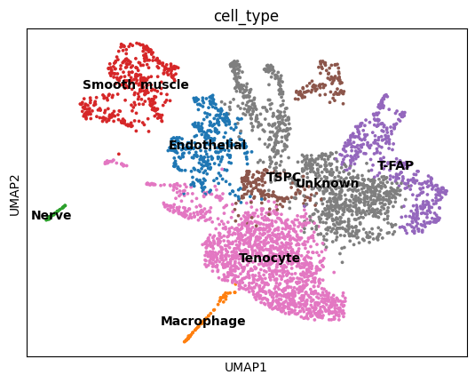

---

## Stage 3A — pySCENIC TF Network Inference ✓

**Goal:** Identify transcription factor regulons enriched in TSPC vs. T-FAP in both datasets independently, then find cross-dataset consistent TFs.  
**Scripts:** `scripts/sh/pyscenic_*.sh` (HPC), `scripts/ipynb/04_pyscenic_analysis.ipynb`

Pipeline run on Alliance Canada HPC (NIBI): GRNBoost2 → cisTarget motif pruning → AUCell scoring. Produced **153 Harvey** and **157 Cherief** regulons. AUCell scores compared between TSPC and T-FAP by Wilcoxon test; cross-dataset direction filter retained only regulons with positive Wilcoxon score in both datasets.

**Correction (2026-08-05):** this line previously read "471 Harvey and 417 Cherief regulons". Those are the raw *line counts* of `harvey_regulons.csv` and `cherief_regulons.csv`, not regulon counts. The cisTarget output holds one row per TF × enriched-motif module (468 and 414 data rows, plus 3 header lines); a regulon is one TF, whose target set is the union across its motif rows, and that is what AUCell scores — 153 and 157 respectively, confirmed against `col_attrs/RegulonsAUC` in the AUCell looms. The wrong figure originated in a mislabelled `wc -l` in `pyscenic_04_ctx.sh` (since fixed). **No computed result is affected:** every notebook that extracts target genes (05, 07, 07b) already unions across motif rows correctly, so the 1,682 target genes, the 119-gene overlap, the per-TF driver counts, and the classifier panels are unchanged. The correction does change the denominator — 15 consistent T-FAP regulons out of ~153 screened, not 471. The same wrong figure remains in `docs/md/intermediate-reflection.md`, `storyboard_outline.md`, and `timeline.md`, which are left as dated records of what was believed at the time.

**Result: 15 T-FAP regulons consistent across both datasets; 0 TSPC regulons.**

| Group | Regulons |
|---|---|
| AP-1 family | Fos, Fosb, Jun, Junb, Jund, Atf3 |
| KLF family | Klf6, Klf9 |
| Inflammatory TFs | Nfkb1, Irf1, Egr1, Cebpd |
| Other | Pbx1, Prdm16, Zfp369 |

These form a coherent **pro-fibrotic / activated-fibroblast** program. TSPC-specific TFs in Harvey (E2f1, Fli1, Arnt2 — cell cycle / ETS / progenitor programs) are reversed or absent in injured Cherief tendons, reflecting the homeostatic vs. post-injury context difference.

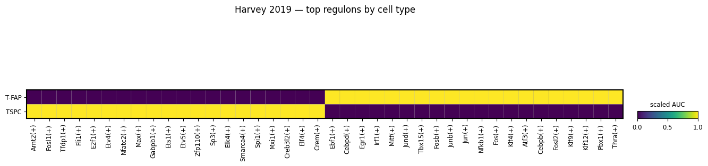

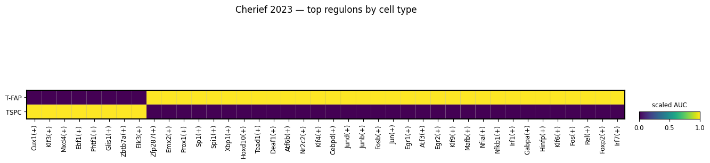

**Implication for classifier:** T-FAP regulon AUC scores as positive fibrotic features; TSPC identified by expression markers (Tppp3, Prg4) since consistent TF regulons are absent.

**Robustness check (2026-07-18):** an independent audit raised the concern that "0 consistent TSPC regulons" could be a statistical power artifact — TSPC has far fewer cells than T-FAP in both datasets (Harvey 266 vs. 433; Cherief 451 vs. 1245), and the original cross-dataset filter ranked by raw Wilcoxon score (`head(50)`), which scales with n. This was tested directly in `scripts/ipynb/04b_pyscenic_powermatched_filter.ipynb`: a stability-selection re-analysis (200 iterations of downsampling T-FAP to TSPC's n per dataset, BH-corrected each time, selection frequency ≥0.95 in both datasets required) **reproduces the original result** — 14/15 T-FAP regulons replicate (Prdm16 drops, Zfx enters, both borderline) and TSPC still returns zero. The three candidate TSPC regulons flagged by the audit (Cux1, Klf3, Mxd4) fail in Harvey for reasons other than power: Cux1/Mxd4 aren't detected as regulons in Harvey at all (cisTarget found no motif-supported target set), and Klf3 is genuinely null in Harvey even at matched sample size (selection_freq=0.05). **Conclusion: the 0-TSPC-regulon result is not a sample-size artifact** — power-matching does not change it. This does not rule out a real-but-small TSPC TF effect that both datasets are jointly too small to detect (no more Harvey/Cherief TSPC cells exist to add) — that remains an honest limitation, not a re-opened question.

**Does the Prdm16→Zfx swap affect Stage 7?** No — checked directly. Zfx has only 15 Cherief target genes, none of which overlap the top-200 CellRank T-FAP lineage drivers, so it would contribute zero genes to the Stage 7 candidate list either way (matching Prdm16, which also contributed zero). The 119-gene candidate list built from the original v1 TF list is unaffected by this swap.

---

## Stage 3B — Label Transfer (On Hold)

**Plan:** Transfer Harvey 2019 TSPC/T-FAP labels onto Cherief 2023 cluster 8 via Seurat/scVI to provide independent confirmation of sub-cluster identities.

**Status:** Not urgently needed — sub-cluster identities are already well-supported by marker expression and pySCENIC regulon profiles. Can be done later as a validation step.

---

## Stage 4 — CellRank Fate Trajectory ✓ (with caveats)

**Dataset:** Cherief 2023 cluster 8 sub-clustered AnnData (3,900 cells).  
**Script:** `scripts/ipynb/05_cellrank_fate_trajectory.ipynb`

**Approach:** CellRank 2 PseudotimeKernel (DPT, no RNA velocity — Cherief GEO deposit has no spliced/unspliced counts). Root = Stromal sub-cluster (min DC1). GPCCA with n_states=5 recovered all four cell types as distinct macrostates.

**Caveat — pseudotime ordering:** DPT ranked Tenogenic-progenitor as most progenitor-like (mean DPT 0.18) rather than Stromal (0.29), which is biologically incorrect: Stromal has the imprinted gene signature (Plagl1, Mest, H19) marking undifferentiated state. The DPT is rooted at Stromal but diffusion components place Tenogenic-progenitor cells close to the root in PC space. This makes trajectory ordering unreliable.

**Root-sensitivity check (2026-07-18):** an audit questioned whether the fate probabilities inherit the same distortion as the ordering, since both come from the same pseudotime-kernel transition matrix. `scripts/ipynb/05b_cellrank_root_sensitivity.ipynb` reran the identical pipeline rooted at a Tenogenic-progenitor cell instead of Stromal (i.e. the root DPT's own ranking would pick) and compared fate probabilities:

| | TSPC (innerv.) | T-FAP (innerv.) | TSPC (denerv.) | T-FAP (denerv.) | Shift, innerv.→denerv. |
|---|---|---|---|---|---|
| Original (Stromal root) | 82.6% | 17.2% | 71.0% | 28.9% | TSPC −11.6pp / T-FAP +11.7pp |
| Alternate (Tenogenic-progenitor root) | 76.7% | 23.2% | 64.1% | 35.9% | TSPC −12.6pp / T-FAP +12.7pp |

**Two separable results:** (1) the audit's concern was partly correct — absolute fate probabilities are **not** root-invariant; T-FAP's baseline is ~5–7 points higher under the alternate root. The exact figures below should be read as root-dependent point estimates, not precise ground truth. (2) the **directional finding is robust** — both roots agree closely on the size and direction of the innervated→denervated shift (~12 percentage points toward T-FAP either way). Treat the shift as the trustworthy result; treat the absolute baseline split as approximate.

**Fate probabilities by condition (original root; see root-sensitivity note above for range):**

| Condition | TSPC | T-FAP (total) |
|---|---|---|
| Innervated (TrkAWT) | 0.826 (range 0.77–0.83 across root choices) | 0.172 (range 0.17–0.23) |
| Denervated (TrkAF592A) | 0.710 (range 0.64–0.71) | 0.289 (range 0.29–0.36) |

Direction is consistent with LIANA: denervation shifts progenitor fate allocation toward T-FAP — now confirmed robust to root choice, not just an artifact of one specific (contested) root.

**The check that actually matters for Stage 7 (2026-07-18):** the sensitivity check above tests fate-probability *percentages*, which Stage 7 doesn't use. Stage 7 uses the **119-gene candidate list** (`data/cellrank/pyscenic_cellrank_tfap_overlap.csv`), built from CellRank *lineage driver genes* intersected with pySCENIC targets — a different computation. `05b_cellrank_root_sensitivity.ipynb` §5 reran that specific pipeline under the alternate root: **112 of the 119 candidate genes (94%) are unchanged, Jaccard similarity 0.89.** The gene list Stage 7 will actually consume is substantially more robust to the pseudotime-root problem than the population-level statistics are — good news, and confirmed rather than assumed.

**Top lineage driver genes:**

| Fate | Top drivers (by correlation) |
|---|---|
| TSPC | Igfbp6, Sema3c, Cd55, Crip1, Axl, S100a10, Emp3, Cd34, Tppp3 |
| T-FAP_1 | Gdf10, Fmo2, Abcc9, Ccl11, Il6, C2, Steap4, Junb |
| T-FAP_2 | Cxcl14, Hp, Gas6, Sfrp1, Angptl4, Cxcl12, C3, Sfrp2, Hif1a |

T-FAP_2 drivers (Sfrp1/2, C3, Hif1a) overlap strongly with the complement/hypoxia signature seen in DEG analysis. TSPC drivers include Sema3c, consistent with LIANA finding that attractive semaphorins are enriched in the innervated niche.

**pySCENIC × CellRank overlap** (`data/cellrank/pyscenic_cellrank_tfap_overlap.csv`): 119 genes are both CellRank T-FAP lineage drivers (top 200, union of T-FAP_1 and T-FAP_2) and targets of one or more of the 15 consistent pySCENIC T-FAP regulons. Top genes: Gdf10 (Junb/Klf9), Il6 (Junb), Steap4 (Egr1/Junb), Angptl4 (Junb), Sfrp1 (Fosb), C3 (Junb), Sfrp2 (Jun), Vcam1 (Nfkb1). Most are targets of AP-1 (Junb/Jund/Fos) and KLF (Klf9/Klf6) regulons — consistent with the pySCENIC result. These 119 genes form the mechanism-informed candidate feature set for Stage 7.

---

## Stage 5 — LIANA Cell-Cell Communication ✓

**Goal:** Identify which ligand-receptor signals arriving at TSPC and T-FAP differ between innervated and denervated conditions.  
**Script:** `scripts/ipynb/06_liana_cellcell_communication.ipynb`

`rank_aggregate` (6 methods — CellPhoneDB, Connectome, log2FC, NATMI, SingleCellSignalR, CellChat; mouse consensus LR database) run separately on innervated (11,478 cells) and denervated (8,569 cells) subsets of the full annotated dataset. Differential metric: **`delta_rank = rank_denervated − rank_innervated`** (positive = stronger in innervated; negative = stronger in denervated).

52,646 LR pairs detected in both conditions; 11,669 with TSPC or T-FAP as receiver.

**⚠ Permutation-testing correction (2026-07-18):** the original run set `n_perms=None`, so everything below was originally selected by `delta_rank` alone — a difference of two rank-aggregate scores, not a significance-tested statistic. `scripts/ipynb/06b_liana_permutation_v2.ipynb` reran the identical pipeline with `n_perms=100`, activating real CellPhoneDB-style permutation p-values. Checking the 7 named headline pairs below against their permutation p-value **in the condition where they're claimed to be strong**: only 3 of 7 are actually significant (Bmp3→Bmpr1b p=0.0, Pdgfc→Pdgfra p=0.0, Tnf→Notch1 p=0.0). The other 4 — including **Efna1→Epha3, previously described as "the strongest differential signal overall"** — have p=1.0, i.e. statistically indistinguishable from random cell-label shuffling: Efna1→Epha3, Sema4a→Plxnd1, Wnt5a→Fzd4, and Sema3f→Nrp2_Plxna1 are **not supported** once tested. More broadly, of the top-20 pairs by `delta_rank` in each direction, only 8/20 (innervated) and 12/20 (denervated) clear `cellphone_pvals < 0.05`. Read the tables below as the original `delta_rank`-ranked record; treat only Bmp3→Bmpr1b, Pdgfc→Pdgfra, and Tnf→Notch1 as statistically supported single-pair claims going forward, and do not repeat the "Efna1→Epha3 is the strongest signal" framing on the poster/report.

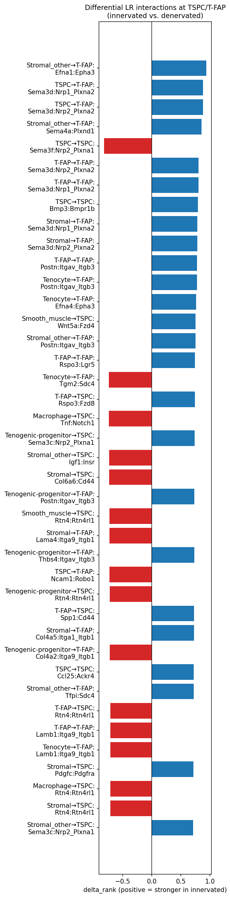

**Signals STRONGER in innervated (positive delta_rank — lost upon denervation):**

| Signal | Sender → Receiver | delta_rank | Interpretation |
|---|---|---|---|
| Efna1 → Epha3 | Stromal_other → T-FAP | +0.94 | Strongest differential signal overall; ephrin-A/EphA3 at T-FAPs in innervated niche |
| Sema4a → Plxnd1 | Stromal_other → T-FAP | +0.86 | Class 4 semaphorin — repulsive axon guidance cue present in innervated niche |
| Bmp3 → Bmpr1b | TSPC → TSPC | +0.79 | Anti-fibrotic autocrine BMP signalling |
| Sema3d → Nrp/Plxna | Multiple → T-FAP | +0.80–0.88 | Attractive class 3 semaphorin; strongest at T-FAP via Nrp1/2_Plxna2 |
| Wnt5a → Fzd4 | Smooth_muscle → TSPC | +0.75 | Non-canonical Wnt progenitor maintenance |
| Sema3c → Nrp2_Plxna1 | Tenogenic-progenitor → TSPC | +0.74 | Attractive semaphorin at TSPC; same ligand acts oppositely at T-FAP (see denervated) |
| Pdgfc → Pdgfra | Stromal → TSPC | +0.71 | Strongest growth-factor signal lost at TSPCs; innervation maintains stromal PDGF-C |
| Tgfb1/3 → Itgb3 | Endothelial, Tenocyte → T-FAP | +0.52–0.66 | TGFβ-integrin signalling at T-FAPs is higher in innervated — likely controlled matrix remodelling rather than pathological fibrosis |
| Bdnf/Ngf → Erbb2 | Multiple → TSPC | +0.26–0.43 | Neurotrophin-receptor axis confirming direct innervation-dependent signalling |

**Signals STRONGER in denervated (negative delta_rank — gained upon denervation):**

| Signal | Sender → Receiver | delta_rank | Interpretation |
|---|---|---|---|
| Sema3f → Nrp2_Plxna1 | TSPC → TSPC | −0.82 | Repulsive semaphorin — autocrine TSPC suppression |
| Tnf → Notch1 | Macrophage → TSPC | −0.74 | Inflammatory Notch activation reduces tenogenic differentiation |
| Sema3c → Nrp1_Nrp2_Plxnd1 | Multiple → T-FAP | −0.66 to −0.70 | Same ligand as innervated TSPC signal but different receptor complex; promotes T-FAP in denervated |
| Rtn4 → Rtn4rl1 | Multiple → TSPC | −0.70 to −0.73 | Nogo/axon-repulsion factor elevated without innervation |
| Lama4/Lamb1 → Itga9_Itgb1 | Multiple → T-FAP | −0.70 to −0.73 | Laminin-integrin ECM route driving T-FAP expansion |

Bubble plots below confirm the overall pattern: innervated niche signals are enriched at both TSPC (growth factors, Wnt, BMP, neurotrophin) and T-FAP (ephrin-A, Sema4a, Sema3d); denervated niche gains inflammatory (TNF-Notch), repulsive (Sema3f, Rtn4), and fibrotic matrix (laminin-integrin) signals.

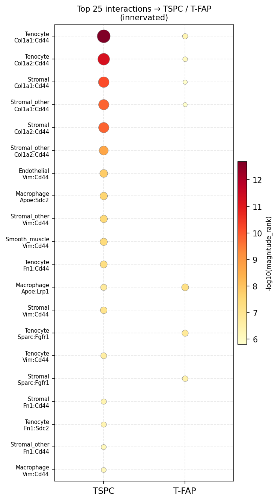

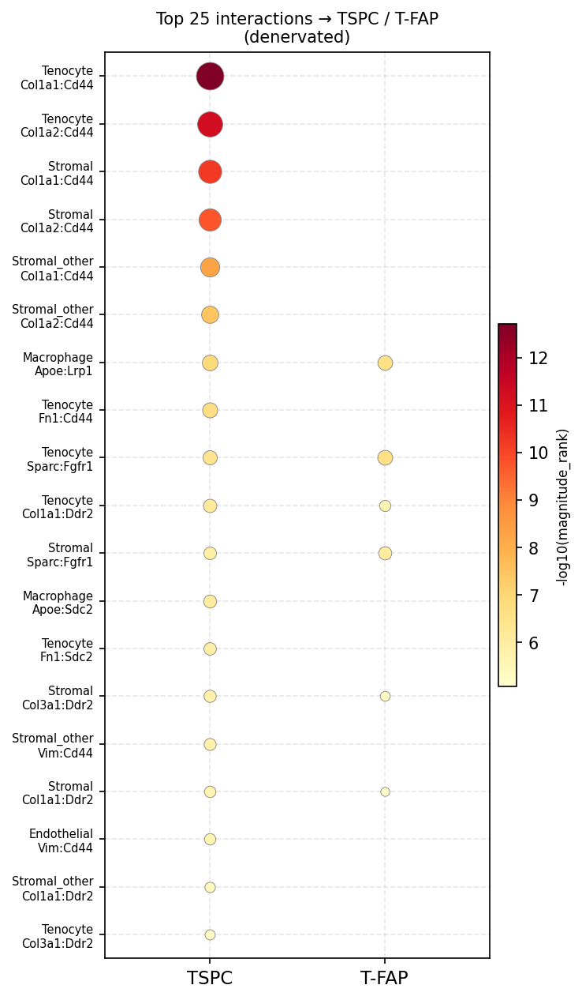

---

## Stage 6 — Mechanistic Synthesis ✓

**Goal:** Integrate pySCENIC TF regulons (Stage 3A), CellRank fate drivers (Stage 4), and LIANA upstream signals (Stage 5) into a single regulatory circuit explaining the TSPC vs. T-FAP fate decision.
**Script:** `scripts/ipynb/07_mechanistic_synthesis.ipynb`

Circuit:
- **Innervated → TSPC fate:** PDGF-C/Wnt5a/BMP3 niche signals (LIANA) → progenitor pool biased toward TSPC (CellRank: 82.6% TSPC fate probability) → suppression of AP-1/KLF/NF-κB TF program → Tppp3+/Igfbp6+/Sema3c+ TSPC maintenance
- **Denervated → T-FAP fate:** Loss of PDGF-C/Wnt5a; TNF → NF-κB (Nfkb1) + Macrophage-Notch suppresses TSPC; laminin-integrin (Lama4/Lamb1 → Itga9/Itgb1) + TGFβ → AP-1/ATF3/KLF activation (Klf6/Klf9/Cebpd/Irf1/Egr1 regulons) → T-FAP program (CellRank: T-FAP fate rises from 17% to 29%); T-FAP drivers Sfrp1/2 (Wnt antagonists), Hif1a (hypoxia), Il6 (JAK-STAT), C3 (complement) reinforce fibrotic identity

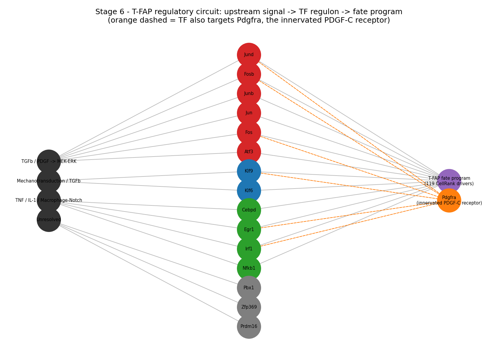
*(Note: the orange dashed "Pdgfra feedback" edges in this figure represent the receptor-feedback claim below, which was later statistically tested and retracted — kept here as the original record.)*

**Corrected version for poster/report use (2026-07-18):** regenerated in `scripts/ipynb/07b_receptor_feedback_v2_tested.ipynb` §6 with the retracted Pdgfra feedback edges removed; everything else (family grouping, CellRank-driver-count edges to the fate program) is unchanged.

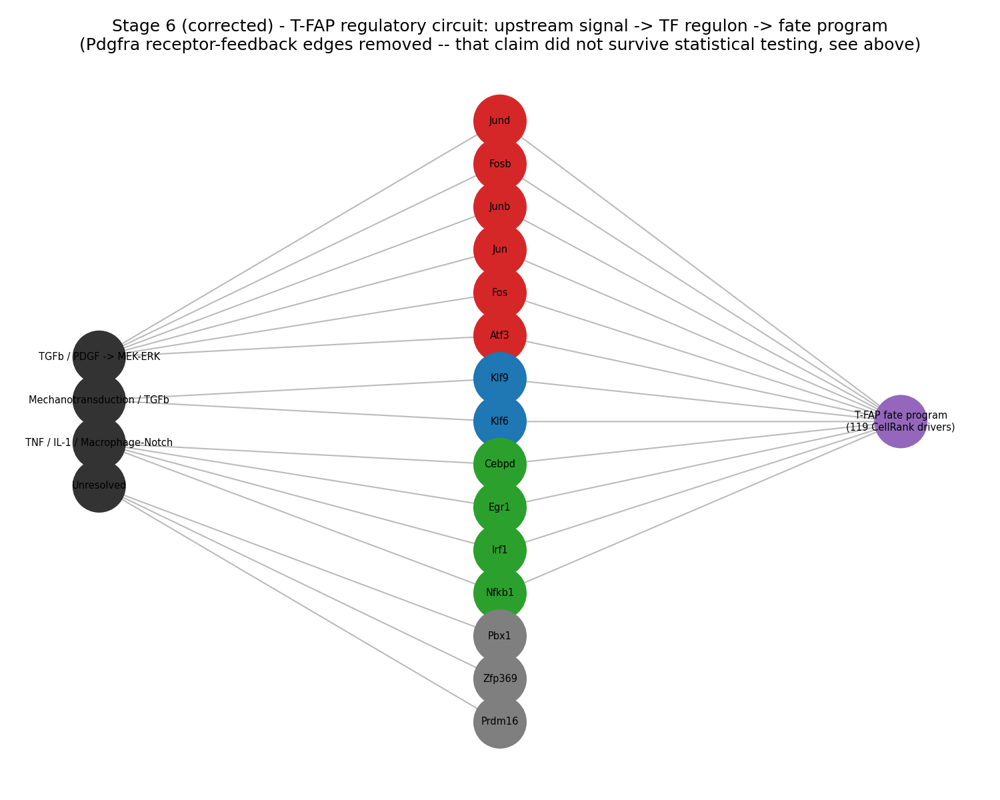

**Which regulons actually anchor the CellRank fate program:** re-aggregating the 119-gene pySCENIC × CellRank overlap by TF shows Junb (35 genes) and Jund (31 genes) contribute more than double any other regulon, followed by Klf9 (28). The three "Other" TFs (Pbx1, Prdm16, Zfp369) are differentially active in both datasets but contribute **zero** CellRank fate-driver genes — markers of T-FAP transcriptional state, not drivers of fate commitment, and deprioritised for Stage 7.

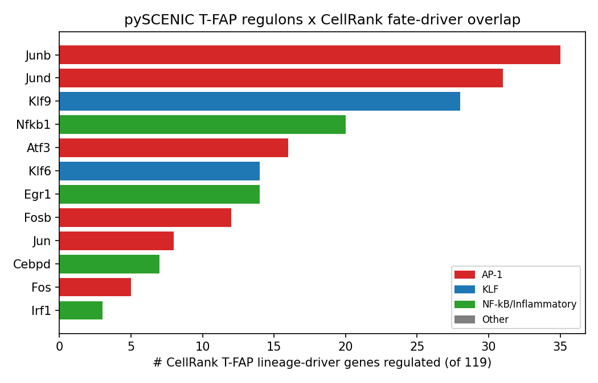

**Receptor feedback claim — retracted after statistical testing (2026-07-18):** the original notebook reported that several T-FAP regulons target the receptor genes for headline LIANA signals (e.g. 6 regulons targeting `Pdgfra`), framed as a candidate feedback mechanism. That was a raw overlap count with no significance test. `scripts/ipynb/07b_receptor_feedback_v2_tested.ipynb` tests it properly: a hypergeometric enrichment test run separately per dataset (correct background gene universe per dataset, per-dataset target sets rather than the union, which had inflated the apparent overlap by pooling both datasets together), Fisher-combined, BH-corrected across the 15 TFs. **Nothing survives — not even at raw uncorrected p<0.05** (best case: Fos, combined p≈0.056). This finding is retracted, not just caveated: the T-FAP TF program's overlap with LIANA receptor genes is statistically indistinguishable from chance. (The GRNBoost2 target-gene lists this check depends on were also generated by a single unseeded run — see Stage 3A robustness note — so even if the overlap had been significant, the specific target list wouldn't be guaranteed to reproduce.)

Additional threads from Stage 4:
- **Sema3c** is both a LIANA innervated signal (attractive semaphorin lost upon denervation) and a CellRank TSPC lineage driver — strongest cross-stage convergence point for TSPC maintenance
- **Sfrp1/2** appear as T-FAP_2 CellRank drivers and Fosb/Jun targets — Wnt antagonism as a T-FAP self-reinforcing mechanism
- **119-gene pySCENIC × CellRank overlap** (dominated by Junb/Jund/Klf9 targets) represents the mechanism-informed candidate feature set for Stage 7

**Caveat:** signal-to-TF-*family* links (TNF → NF-κB; TGFβ → AP-1/ATF3; PDGF → MEK/ERK → AP-1) remain literature-bridged, not directly tested — the raw GRNBoost2 adjacency tables needed to test this quantitatively exist only on HPC scratch (`pyscenic_03_grn.sh` output) and were not pulled into this repo. Cross-dataset target-*gene* identity is also much less consistent than target-*TF* activity (e.g. Cebpd/Pbx1/Zfp369/Prdm16 share 0 target genes between Harvey and Cherief despite consistent regulon activity) — individual TF→target edges above should be read as dataset-specific hypotheses, not confirmed circuitry.

---

## Stage 7 — Feature Selection ✓

**Goal:** Reduce the 119-gene pySCENIC × CellRank T-FAP overlap (`data/cellrank/pyscenic_cellrank_tfap_overlap.csv`) plus 5 TSPC markers (Tppp3, Prg4, Igfbp6, Sema3c, Cd34) — 124 candidates total — to a minimal classifier panel, applying LASSO, Boruta, and XGBoost independently on Harvey 2019 TSPC (266) vs. T-FAP (433) cells and taking the intersection of genes selected by ≥2 of 3 methods.
**Script:** `scripts/ipynb/08_feature_selection.ipynb`

Per-method yield: LASSO 65 genes (10-fold CV, L1 logistic regression, C=1.62), Boruta 52 confirmed genes (+2 tentative), XGBoost 33 genes (above-mean gain importance). **≥2/3-method intersection: 44 genes** — larger than the ~10–30 target, expected since the 124-candidate pool was already twice-filtered (pySCENIC regulon membership, then CellRank lineage-driver correlation) before any of the three methods ran, so a high hit rate reflects a pre-enriched input rather than under-selective methods.

Two tiers saved to `data/feature_selection/`:
- **`final_panel_annotated.csv` (44 genes, ≥2/3 methods)** — the literal Stage 7 deliverable per the stated rule.
- **`core_panel_unanimous.csv` (23 genes, unanimous 3/3)** — falls inside the ~10–30 target; recommended starting panel for Stage 8, with the 44-gene panel available for a robustness pass.

**Notable:** all 5 hand-picked TSPC markers independently cleared the ≥2/3 bar (Tppp3, Sema3c even hit unanimous 3/3), despite none of the three methods knowing which candidates were TSPC- vs. T-FAP-derived. 30/44 (68%) of the selected genes — 14/23 (61%) of the unanimous core — are Junb/Jund/Klf9 targets, consistent with Stage 6's finding that these three regulons anchor most of the CellRank T-FAP driver overlap (this fact was used only as a post-hoc annotation, not inside any of the three methods).

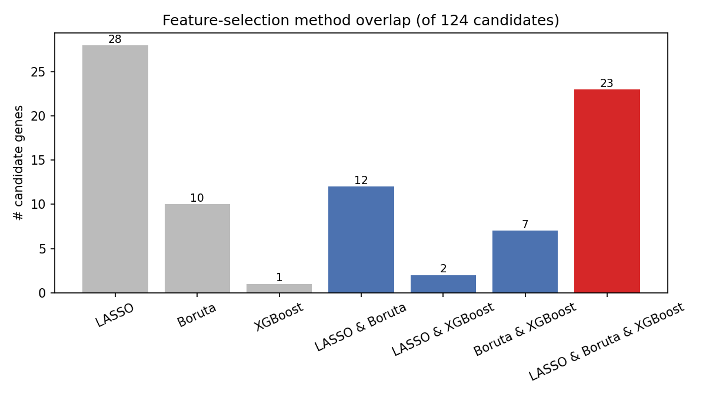

**Caveats carried into Stage 8:** no biological replicates in Harvey 2019 (single pooled sample per condition) — CV folds here are cell-level splits within one sample, not independent-sample generalisation; Cherief 2023 (innervated vs. denervated) is the real generalisation test in Stage 8. Harvey's T-FAP cluster was excluded from trajectory analysis by the original paper's own authors — T-FAP is this project's own annotation, not an externally validated cell state. Cross-method agreement establishes consistent differential expression across three modelling assumptions, not causal relevance to fate commitment.

---

## Stage 8 — Classifier Training & Validation ✓

**Goal:** Train a TSPC vs. T-FAP classifier on the Stage 7 gene panels and validate it on an independent dataset.
**Script:** `scripts/ipynb/09_classifier_training_validation.ipynb`

Logistic regression (L2, class-balanced) trained on Harvey 2019 for both the `core_23` (unanimous 3/3) and `full_44` (≥2/3) panels, 10-fold stratified CV: `core_23` ROC-AUC 0.993 / accuracy 96.6%; `full_44` ROC-AUC 0.995 / accuracy 97.7%.

**Cross-dataset generalisation on Cherief 2023** — Cherief's `cell_type` label is independently marker-based (Stage 1c), not transferred from Harvey (Stage 3B is on hold), so this is a genuine held-out test: `core_23` ROC-AUC 0.989 / accuracy 93.5% / balanced accuracy 88.3%; `full_44` ROC-AUC 0.977 / accuracy 92.7% / balanced accuracy 88.2%. **The smaller 23-gene panel matches or edges out the 44-gene panel out-of-dataset** despite trailing it in-dataset — recommended as the Stage 9 primary panel. Both panels share a real weak point: TSPC recall is only 77–78% on Cherief (T-FAP recall 98–99%), mirroring the class imbalance in Harvey training data (266 TSPC vs. 433 T-FAP) and the Stage 3A finding that TSPC has a weaker transcriptional signature than T-FAP in this system — the eventual healing-index score will be more reliable for flagging fibrotic drift than for confidently confirming full regenerative identity.

**Distributional shift check** (all 3,900 Cherief cluster-8 cells, matching Stage 4's CellRank population): mean P(T-FAP) rises Innervated→Denervated, 0.732→0.881 (`core_23`) and 0.684→0.818 (`full_44`) — correct direction, qualitatively consistent with CellRank's independently-derived 17.2%→28.9% T-FAP fate-probability shift, though the two scores are different model outputs and not directly comparable in magnitude. Part of the population-level shift is a composition effect already documented in Stage 1c (T-FAP's share of cluster-8 rises 26.3%→38.4%, TSPC's falls 15.8%→6.7%), but a genuine within-population signal survives it too: cells still labelled TSPC score higher toward T-FAP after denervation (0.217→0.381, `core_23`), a graded-drift signal rather than a clean binary switch.

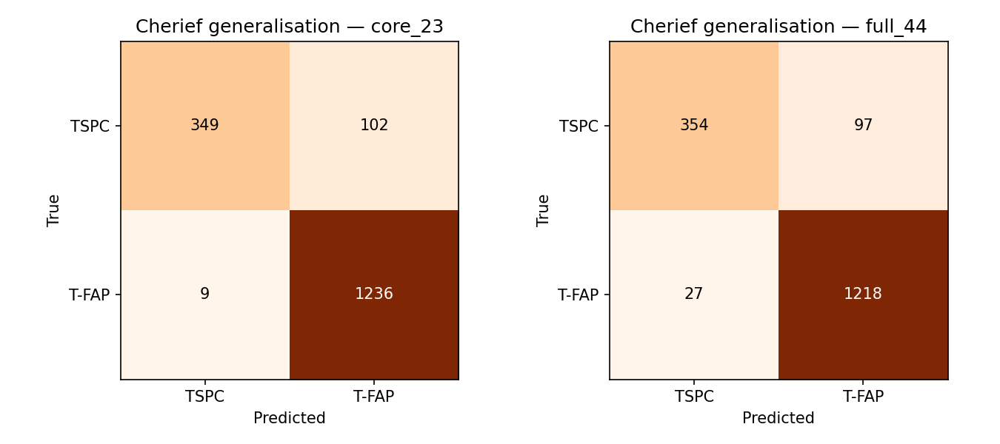
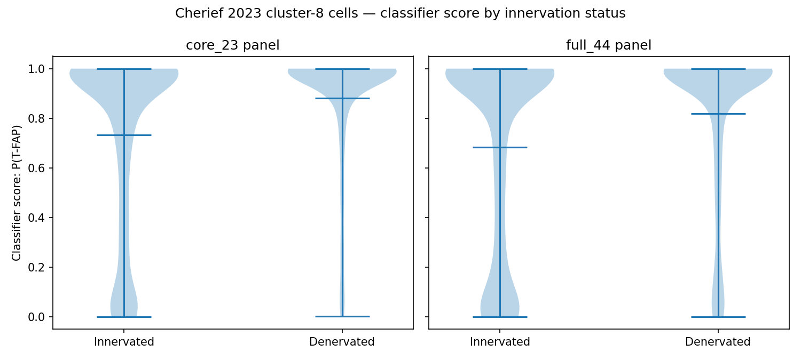

Saved models: `data/classifier/classifier_core_23.joblib`, `classifier_full_44.joblib` (scaler + logistic regression bundles). `data/classifier/cherief_healing_index_scores.csv` carries per-cell P(T-FAP) scores forward into Stage 9.

**Caveats carried into Stage 9:** no biological replicates in either dataset; no batch correction between Harvey and Cherief beyond per-gene standardisation fit on Harvey alone (different labs, and uninjured-vs-post-injury contexts); Cherief's T-FAP inherits the same project-defined-annotation caveat as Harvey's.

---

## Stage 9 — Continuous Healing Index Score ✓

**Goal:** Convert the Stage 8 binary classifier into a continuous per-cell score, apply it across datasets, and prepare it for future lab data.
**Script:** `scripts/ipynb/10_healing_index.ipynb`

**Score construction:** built on the classifier's raw log-odds (`decision_function`) rather than the sigmoid probability — the Stage 8 probability was heavily saturated (65% of Cherief cluster-8 cells at P(T-FAP) < 0.05 or > 0.95), losing resolution exactly where a continuous index is most useful. The **Healing Index** (0–100, higher = regenerative/TSPC-like) is the log-odds percentile-ranked against a fixed Harvey 2019 reference distribution, so the scale stays interpretable and comparable across datasets rather than being re-normalised per dataset.

**Applied to Cherief 2023** (all 3,900 cluster-8 cells): Innervated mean 25.2 (median 18.9) vs. Denervated mean 15.5 (median 12.4) — correct direction, and now with real distributional structure instead of the Stage 8 probability's pile-up at the extremes. By sub-cluster: TSPC highest (52.0), T-FAP lowest (7.4), Stromal (22.3) and Tenogenic-progenitor (21.2) — both never seen in training — sit sensibly in between.

**Independent cross-check:** Spearman rho = 0.656 (p≈0) between the Healing Index and CellRank's TSPC terminal-state fate probability (Stage 4) — two methods sharing no code path. Not a perfect correlation, and shouldn't be: CellRank's DPT-based ordering was already flagged as unreliable in Stage 4, visible here as a band of cells at CellRank probability ≈1.0 spanning a wide range of Healing Index values. Read this as directional corroboration, not validation against ground truth.

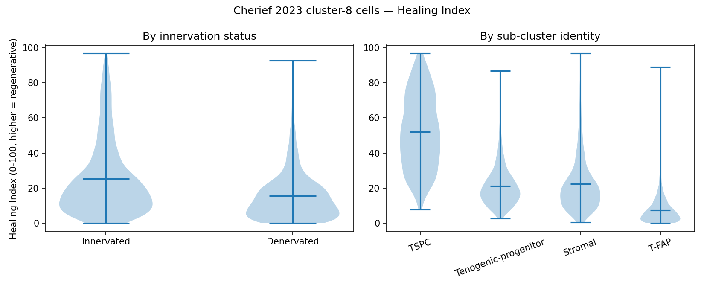
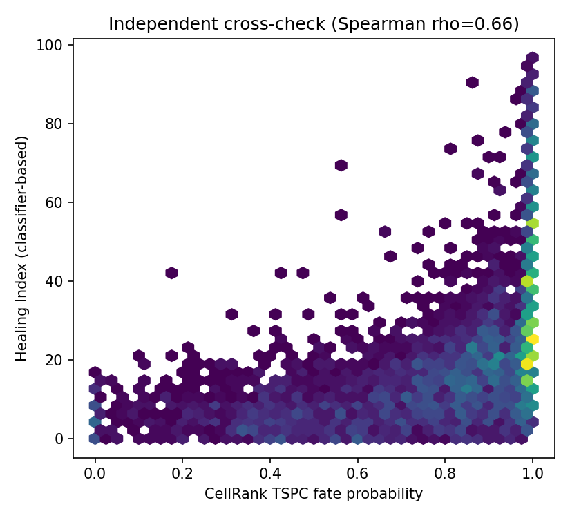

**New lab data:** no third tendon scRNA-seq dataset exists in this repository. `score_new_dataset()` in the notebook is a documented, one-call function that scores a new `.h5ad` against the same fixed Harvey reference (saved at `data/healing_index/harvey_reference_scores.npy`) the moment one is available — not demonstrated against fabricated data.

**This closes the Stage 0–9 pipeline as originally scoped.** Every validation performed across Stages 7–9 (Harvey CV, Cherief generalisation, the CellRank cross-check) is a within- or cross-*dataset* check — neither dataset has biological replicates, so none of this has yet been tested across independent animals or cohorts. Scoring genuinely new lab-generated data is the natural next step and the first real biological-replicate test this signature will face.

---

## Key Files

| File | Purpose |
|---|---|
| `data/Cherief_scRNA-seq/GSE244921_processed.h5ad` | Processed Cherief 2023 AnnData (22,615 cells) |
| `data/Cherief_scRNA-seq/GSE244921_cluster8_sub.h5ad` | Cluster 8 sub-clustered AnnData (TSPC/T-FAP/Tenogenic-progenitor/Stromal) |
| `data/Harvey_scRNA-seq/harvey2019_processed.h5ad` | Processed Harvey 2019 AnnData (4,069 cells) |
| `data/pyscenic/harvey_aucell.loom` | pySCENIC AUCell output — Harvey (153 regulons) |
| `data/pyscenic/cherief_aucell.loom` | pySCENIC AUCell output — Cherief (157 regulons) |
| `data/pyscenic/shared_diff_regulons.csv` | 15 cross-dataset T-FAP regulons (consistent direction) |
| `data/liana/liana_innervated.csv` | Full LIANA result — innervated (56,701 LR pairs) |
| `data/liana/liana_denervated.csv` | Full LIANA result — denervated (57,233 LR pairs) |
| `data/liana/liana_differential_stromal_receivers.csv` | Delta_rank filtered to TSPC/T-FAP receivers (11,669 pairs) |
| `data/cellrank/pyscenic_cellrank_tfap_overlap.csv` | 119-gene pySCENIC × CellRank T-FAP overlap — mechanism-informed feature candidates for Stage 7 |
| `data/cellrank/lineage_drivers_TSPC.csv` | CellRank TSPC lineage drivers (7,000 significant genes) |
| `data/cellrank/lineage_drivers_T-FAP_1.csv` | CellRank T-FAP_1 lineage drivers (7,223 significant genes) |
| `data/cellrank/lineage_drivers_T-FAP_2.csv` | CellRank T-FAP_2 lineage drivers (4,449 significant genes) |
| `data/Cherief_scRNA-seq/GSE244921_cluster8_cellrank.h5ad` | Cluster 8 AnnData with fate probabilities added (from CellRank) |
| `data/mechanistic_synthesis/tf_signal_target_synthesis.csv` | Stage 6 — per-TF synthesis table (target counts, CellRank drivers, receptor feedback targets) |
| `data/mechanistic_synthesis/liana_receptor_tf_feedback.csv` | Stage 6 — headline LIANA receptor genes cross-referenced against T-FAP regulon targets |
| `data/feature_selection/gene_selection_by_method.csv` | Stage 7 — all 124 candidates x LASSO/Boruta/XGBoost selection flags |
| `data/feature_selection/final_panel_annotated.csv` | Stage 7 — 44-gene panel selected by >=2/3 methods, annotated with CellRank correlations and regulons |
| `data/feature_selection/core_panel_unanimous.csv` | Stage 7 — 23-gene subset selected unanimously by all 3 methods (falls within ~10-30 target) |
| `data/classifier/classifier_core_23.joblib` | Stage 8 — trained scaler + logistic regression bundle, 23-gene core panel (Stage 9 primary) |
| `data/classifier/classifier_full_44.joblib` | Stage 8 — trained scaler + logistic regression bundle, 44-gene full panel (robustness check) |
| `data/classifier/cherief_healing_index_scores.csv` | Stage 8 — per-cell P(T-FAP) classifier score for all 3,900 Cherief cluster-8 cells, both panels |
| `data/classifier/harvey_cv_metrics.csv` | Stage 8 — Harvey 10-fold CV metrics (ROC-AUC, accuracy, balanced accuracy, F1) per panel |
| `data/classifier/cherief_generalization_metrics.csv` | Stage 8 — Cherief cross-dataset generalisation metrics per panel |
| `data/healing_index/harvey_reference_scores.npy` | Stage 9 — fixed Harvey 2019 reference distribution used to percentile-calibrate the Healing Index |
| `data/healing_index/cherief_healing_index.csv` | Stage 9 — per-cell Healing Index (0-100) for all 3,900 Cherief cluster-8 cells |
| `scripts/ipynb/01_cherief2023_qc_clustering.ipynb` | Cherief 2023 — QC, clustering, annotation |
| `scripts/ipynb/02_cherief2023_subcluster_tspc_tfap.ipynb` | Cluster 8 sub-clustering → TSPC/T-FAP |
| `scripts/ipynb/03_harvey2019_qc_clustering.ipynb` | Harvey 2019 — QC, clustering, marker annotation |
| `scripts/ipynb/04_pyscenic_analysis.ipynb` | pySCENIC AUCell analysis — UMAP, differential regulons, cross-dataset comparison |
| `scripts/ipynb/05_cellrank_fate_trajectory.ipynb` | CellRank fate trajectory — DPT, macrostates, fate probabilities, lineage drivers |
| `scripts/ipynb/06_liana_cellcell_communication.ipynb` | LIANA CCC — annotation, rank_aggregate, differential, visualisation |
| `scripts/ipynb/07_mechanistic_synthesis.ipynb` | Stage 6 — TF regulon × CellRank driver × LIANA receptor cross-referencing, regulatory circuit diagram |
| `scripts/ipynb/08_feature_selection.ipynb` | Stage 7 — LASSO/Boruta/XGBoost feature selection on Harvey 2019 TSPC/T-FAP, method-overlap intersection |
| `scripts/ipynb/09_classifier_training_validation.ipynb` | Stage 8 — logistic regression classifier, Harvey CV + Cherief cross-dataset generalisation + distributional shift check |
| `scripts/ipynb/10_healing_index.ipynb` | Stage 9 — continuous Healing Index (percentile-calibrated log-odds), CellRank cross-check, turnkey scoring function for new data |
| `scripts/sh/pyscenic_00_setup.sh` | HPC environment setup (patched pySCENIC 0.12.0) |
| `scripts/sh/pyscenic_03_grn.sh` | SLURM: GRNBoost2 TF-gene co-expression |
| `scripts/sh/pyscenic_04_ctx.sh` | SLURM: cisTarget motif pruning |
| `scripts/sh/pyscenic_05_aucell.sh` | SLURM: AUCell regulon scoring |
| `scripts/sh/cellranger_harvey.sh` | Cell Ranger count job on HPC (mm10, 16 cores) |
| `figures/Cherief_scRNA-seq/` | All Cherief 2023 analysis figures |
| `figures/Harvey_scRNA-seq/` | Harvey 2019 QC and clustering figures |
| `figures/pyscenic/` | pySCENIC regulon UMAP and heatmap figures |
| `figures/liana/` | LIANA differential and bubble plot figures |
| `figures/mechanistic_synthesis/` | Stage 6 — regulatory circuit diagram, TF × CellRank driver bar chart |
| `figures/feature_selection/` | Stage 7 — LASSO/Boruta/XGBoost method-overlap bar chart |
| `figures/classifier/` | Stage 8 — CV/generalisation confusion matrices, classifier score-shift violin plot |
| `figures/healing_index/` | Stage 9 — Healing Index distributions, CellRank cross-check scatter |
| `figures/pipeline_flowchart.png` | Full analysis pipeline diagram |
| `docs/research-plan.md` | Detailed scientific rationale and pipeline |
